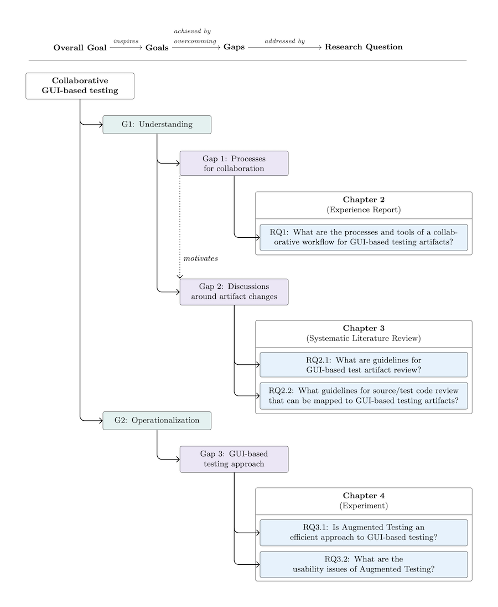
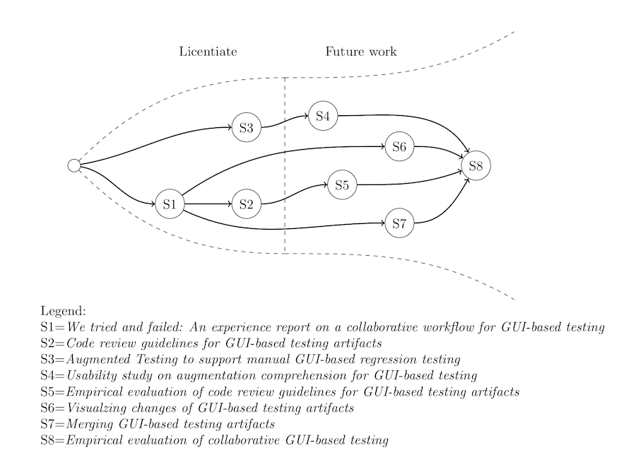
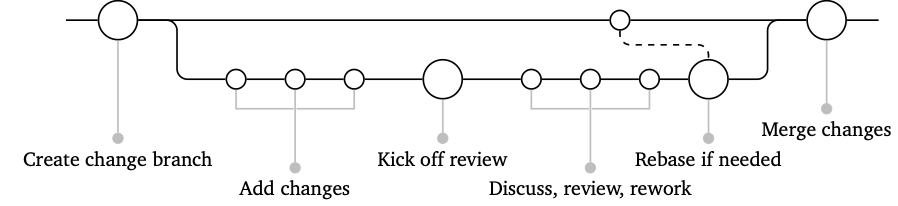

# Beauty and the TikZ

This is collection of my and others Tikz figures.

## My Figures

### Goals, gaps, and requirements: [goals-gaps-rq.tex](./goals-gaps-rq.tex)

Example: 

### Future research/studies: [future-research.tex](./future-research.tex)

## External sources

### Code review: [code_review.tex](https://gist.github.com/michaeldorner/ebc6a07ad83ff819d692858f593e0d11)

Created by [Michael Dorner](https://github.com/michaeldorner)

## License

Copyright © 2023 Andreas Bauer

This work (TikZ source code) is licensed under  [MIT](./LICENSE).
