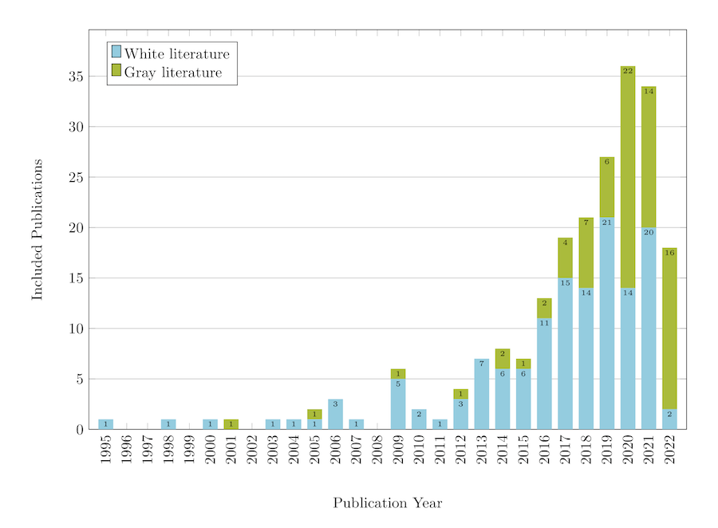
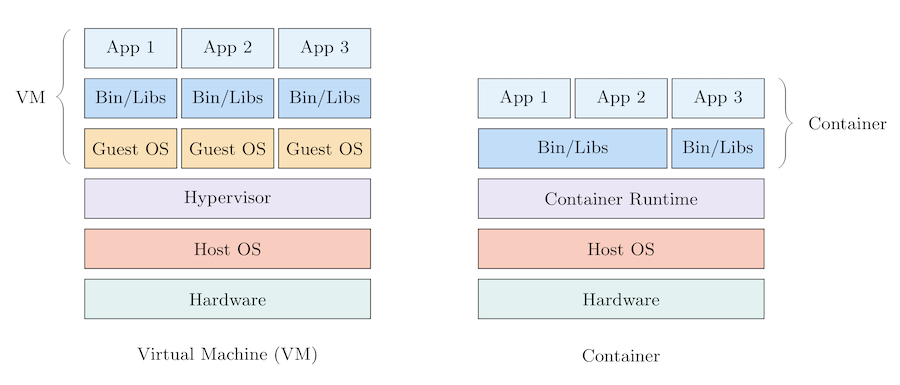
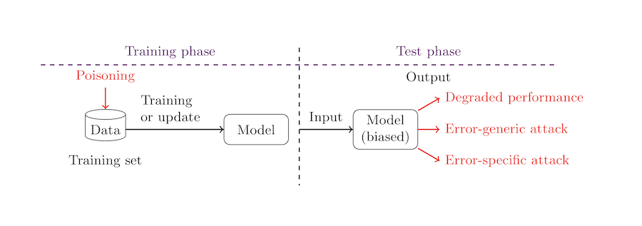
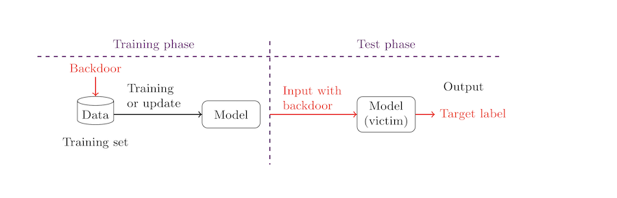
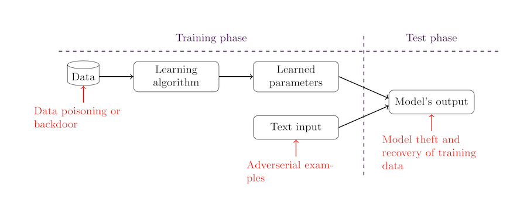
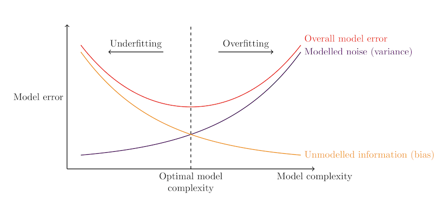
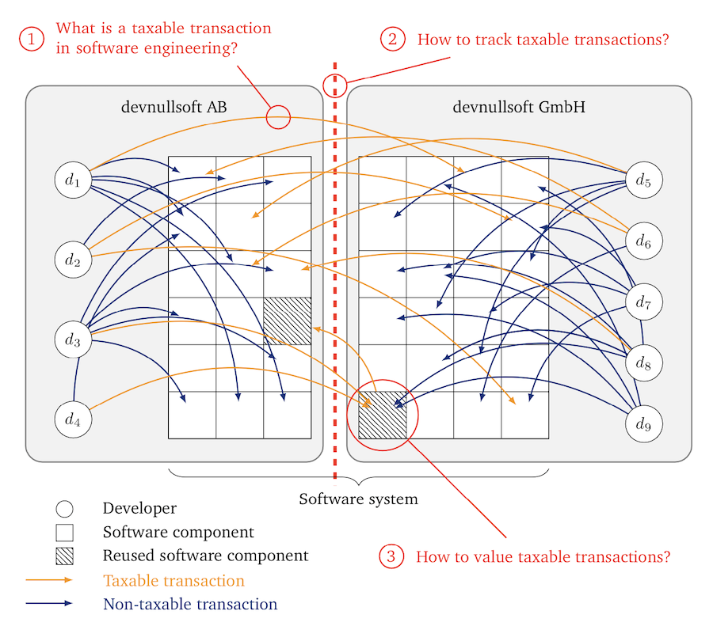

# Beauty and the TikZ

This is collection of my and others' TikZ figures.

## My Figures

### Goals, gaps, and research questions: [goals-gaps-rq.tex](./goals-gaps-rq.tex)

### Future research/studies: [future-research.tex](./future-research.tex)

### Stacked bar chart: [stacked-bar-chart.tex](./stacked-bar-chart.tex)

### VM vs container: [vm-vs-container.tex](./vm-vs-container.tex)

### Data poisoning

Data poisoning figures have been adapted from the following paper:

Xue, M., Yuan, C., Wu, H., Zhang, Y., & Liu, W. (2020). **Machine learning security: Threats, countermeasures, and evaluations**. IEEE Access, 8, 74720-74742. DOI: [10.1109/ACCESS.2020.2987435](https://doi.org/10.1109/ACCESS.2020.2987435)

[data-poisoning1.tex](./data-poisoning1.tex)

[data-poisoning2.tex](./data-poisoning2.tex)

[data-poisoning3.tex](./data-poisoning3.tex)

## Other contributions

### Code review: [code_review.tex](https://gist.github.com/michaeldorner/ebc6a07ad83ff819d692858f593e0d11)

Created by [Michael Dorner](https://github.com/michaeldorner)

### Model fitting: [model-fitting.tex](./model-fitting.tex)

Created by [Michael Dorner](https://github.com/michaeldorner)

### Taxable transactions: [taxable-transactions.tex](./taxable-transactions.tex)

Created by [Michael Dorner](https://github.com/michaeldorner)

## License

Copyright © 2023-2024 Andreas Bauer

This work (TikZ source code) is licensed under [MIT](./LICENSE).
